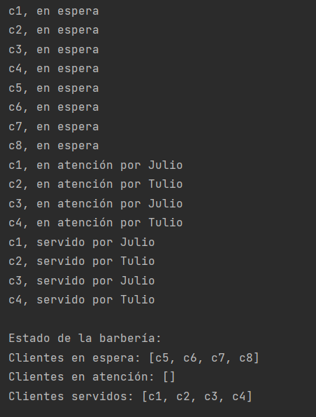

# Barbería - Gestión de clientes

## Descripción del proyecto

Este proyecto es una aplicación que simula la gestión de clientes en una barbería. Los barberos atienden a los clientes en orden de llegada y los etiquetan con los estados de "en espera", "en atención" y "servido". La barbería tiene un límite máximo de clientes en espera, y si se alcanza, se muestra un mensaje de que están ocupados.

## Requisitos previos

- Java Development Kit (JDK) 19 instalado en su sistema.

## Instrucciones para ejecutar el proyecto

1. Clonar el repositorio o descargar el código fuente en una carpeta local.

2. Abrir una terminal o línea de comandos y navegar a la carpeta donde se encuentra el archivo `Main.java`.

3. Compilar el código ejecutando el siguiente comando:
   
       4. javac Main.java

4. Ejecutar la aplicación con el siguiente comando:
   
       java Main

5. La aplicación mostrará la salida en la consola con los resultados de la gestión de los clientes en la barbería.

## Estructura del proyecto

El proyecto está organizado en paquetes para mantener una estructura clara y ordenada.

- Paquete `src.main`: Contiene la clase `Main` con el método `main`, que es el punto de entrada de la aplicación.

- Paquete `src.barberia`: Contiene la clase `Barberia`, que gestiona la lógica relacionada con la barbería, y la interfaz `IAtencionCliente`, que define los métodos para manejar a los clientes.

- Paquete `src.barberos`: Contiene la clase `Barbero`, que representa a los barberos y contiene métodos específicos para atender y servir a los clientes.

## Ejemplo de uso

El programa mostrará mensajes de "en espera", "en atención" y "servido" para los clientes atendidos por los barberos, siguiendo el orden de llegada de los clientes. Además, mostrará mensajes si la barbería está ocupada y no puede recibir más clientes en espera.

      c1, en espera
      c2, en espera
      c3, en espera
      c4, en espera
      c5, en espera
      c6, en espera
      c7, en espera
      c8, en espera
      Julio está disponible para atender.
      Tulio está disponible para atender.
      c1, en atención por Julio
      c2, en atención por Tulio
      Julio está disponible para atender.
      Tulio está disponible para atender.
      c1, servido por Julio
      c2, servido por Tulio
      Julio está disponible para atender.
      Tulio está disponible para atender.
      c3, en atención por Julio
      c4, en atención por Tulio
      
      ...
      
      Estado de la barbería:
      Clientes en espera: [c9, c10, c11, c12, c13, c14, c15, c16]
      Clientes en atención: []
      Clientes servidos: [c1, c2, c3, ..., c8]

# diagrama de clase

codigo mermaid:   

         classDiagram
         class Main {
         - main(String[] args)
         }
         
             class IAtencionCliente {
                 + encolar(String cliente)
                 + atender()
                 + servir()
             }
         
             class Barbero {
                 - nombre: String
                 + Barbero(String nombre)
                 + getNombre(): String
                 + atenderCliente(String cliente)
                 + servirCliente(String cliente)
             }
         
             class Barberia {
                 - barberos: Barbero[]
                 - clientesEspera: Queue<String>
                 - clientesAtencion: Queue<String>
                 - clientesServidos: Queue<String>
                 + Barberia(Barbero[] barberos)
                 + encolar(String cliente)
                 + atender()
                 + servir()
                 + mostrarEstado()
             }
         
             Main --|> Barberia : uses
             Barberia --|> IAtencionCliente : implements
             Barbero "1" --o "n" Barberia : has

# EJEMPLO DE EJECUCION:

## CREADOR: [CARLOS G]